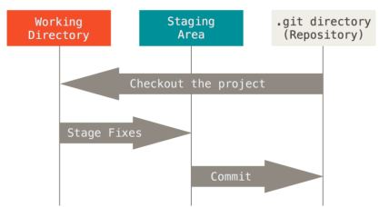

# Git ❓


### 정의 


* 분산버전관리시스템 (원격 저장소 를 통해 협업하고 모든 히스토리를 클라이언트들이 공유)

* 코드의 버전을 관리하는 도구

* 2005년 리누스 토르발스가 개발

* 컴퓨터 파일의 변경사항을 추적하고 여러 명의 사용자들 간에 해당 파일들의 작업을 조율

  

### 기록 방법 (기본 흐름)





1) 작업한 파일 (Working directory)

   ​	파일의 변경사항

   |

   `add `❗

   |

2)  커밋할 목록 (staging area)

   ​	버전으로 기록하기 위한 파일 변경사항의 목록

   |

   `commit` ❗

   |

3)  버전 (Repository)

   ​	커밋(버전)들이 기록되는 곳

   

### 기본 명령어

 ❕ `$ git init`

- 특정 폴더를 git 저장소를 만들어 git으로 관리
  - .git 폴더 생성됨
  - git bash에서는 (master)라는 표기 확인됨


❕ `$ git add <file>`

- working directory상의 변경 내용을 staging area에 추가하기 위해 사용

  - untracked 상태의 파일을 staged로 변경

  - modified 상태의 파일을 staged로 변경

    ```bash
    $ git add b.txt
    $ git add .
    ```

    

❕ `$ git commit -m '<커밋메시지>'`

-  staged 상태의 파일들을 커밋을 통해 버전으로 기록

- SHA-1 해시를 사용하여 40자 길이의 체크섬을 생성하고, 이를 통해 고유한 커밋을 표기

- 커밋 메시지는 변경 사항을 나타낼 수 있도록 명확하게 작성해야 함

  ``` bash
  $ git commit -m 'First commit'
  ```


❕ 현재 상태를 알고 싶을 때

`$ git status`

- git 저장소에 있는 파일의 상태 확인하기 위해 활용

  - Untracked files

     (버전으로 관리된적 없는 파일- 파일 새로 생성한 경우)

  - Changes not staged for commit

    (Modified)

  - Changes to be committed

    (Staged)

- Nothing to commit, working tree clean

  

`$ git log`

- 현재 저장소에 기록된 커밋을 조회

- 다양한 옵션을 통해 로그를 조회

  ``` bash
  $ git log -1
  $ git log --oneline
  $ git log -2 --oneline
  ```

  


### Git 설정 파일 (config)

- 사용자 정보: 커밋 위해 반드시 필요

  - `git config --global user.name "username"`

    - github에서 설정한 username

  - `git config --global user.email "my@email.com"`

    - githun에서 설정한 email

      

- 설정 확인

  - git config -l

  - git config --global -l

  - git config user.name

    

- --system

  - /etc/gitconfig
  - 시스템의 모든 사용자와 모든 저장소에 적용(관리자 권한)

- --global

  - ~/.gitconfig
  - 현재 사용자에 적용되는 설정

- --local

  - .git/config
  - 특정 저장소에만 적용되는 설정


### Git에서 원격 저장소 만들기

1. GitHub에서 New Repository 생성

2. 저장소 설정

3. 주소 확인하기 

   `https://github.com/GitHubUsername/저장소이름.git`

4. 로컬저장소의 버전을 원격저장소로 보내주기

   `$ git remote add origin https://github.com/GitHubUsername/저장소이름.git`

   - remote: 원격저장소
   - add origin: origin으로 추가

5. 원격 저장소로 로컬 저장소 변경사항(커밋)을 올림(push)

   `$ git push <원격저장소이름> <브랜치이름>`

   - 로컬 폴더의 파일git/폴더가 아닌 저장소의 버전(커밋)이 올라감

6. 원격 저장소로부터 변경된 내역을 받아와서 이력을 병합함

   `$ git pull <원격저장소이름> <브랜치이름>`